<h1 align="center">
Cadence MTB
</h1>

A mountain bike app created as a guide and tool for mountain bikers in the Philippines.
 
A Final Year Project Presented to STI College San Jose

## Developers
- [Ezekiel Gutierrez](https://github.com/zeekemeister) 
- Renzo Relos
- [Harry Silan](https://github.com/harlanx)

## Preview

<video src="https://github.com/user-attachments/assets/1ef9d7c1-1a1b-4a39-a137-e917844f17d2"></video>

More Preview

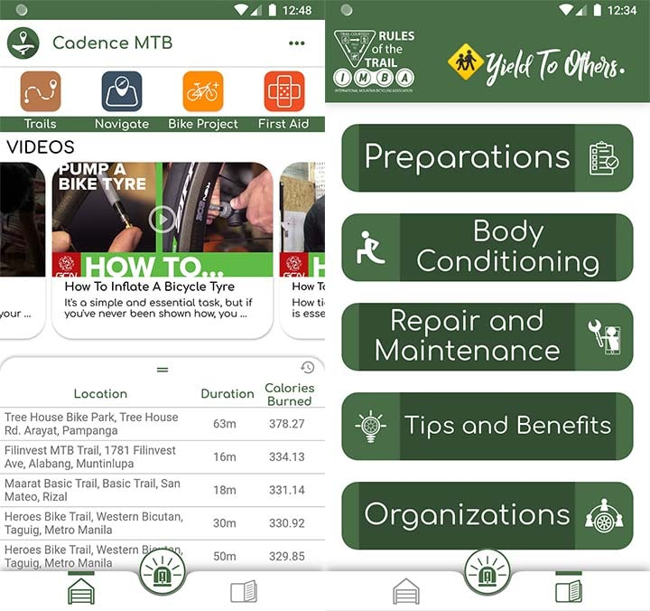
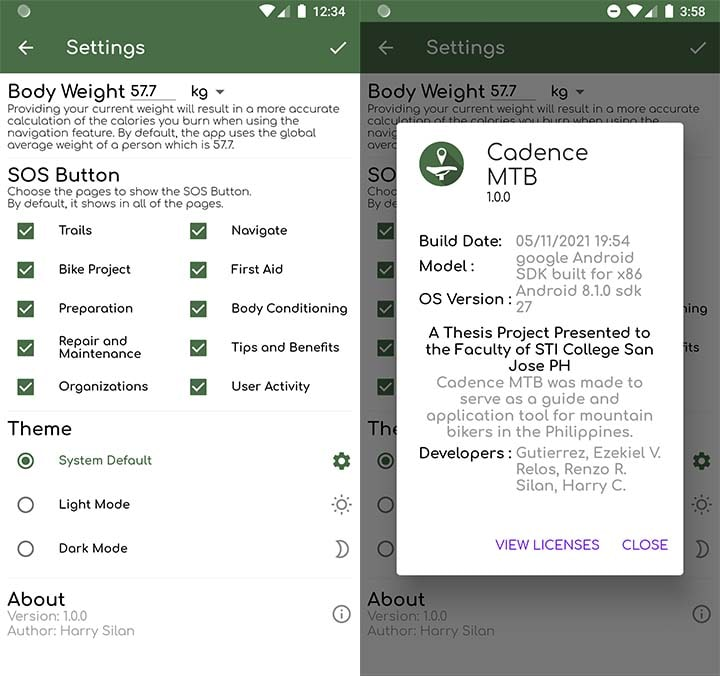
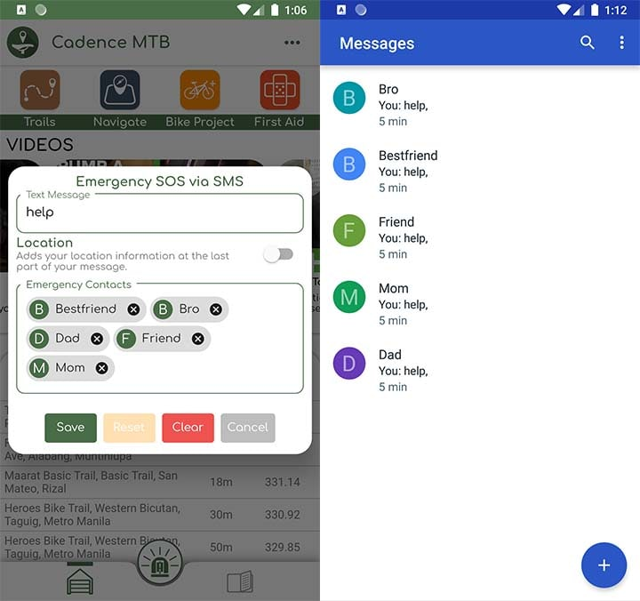
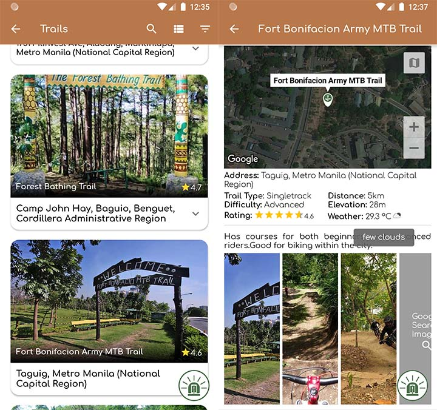
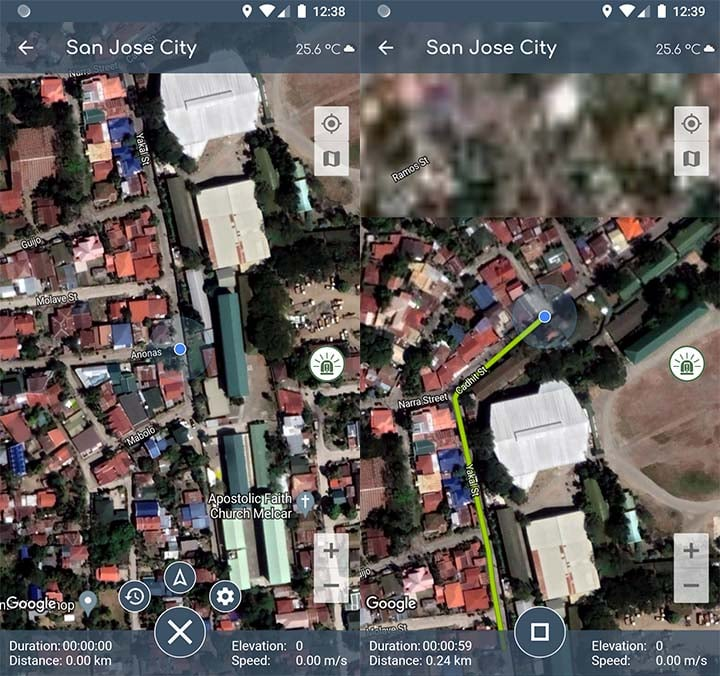
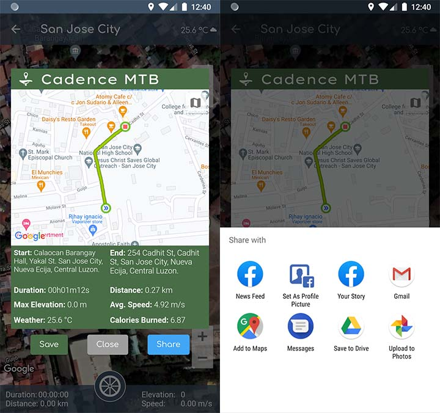
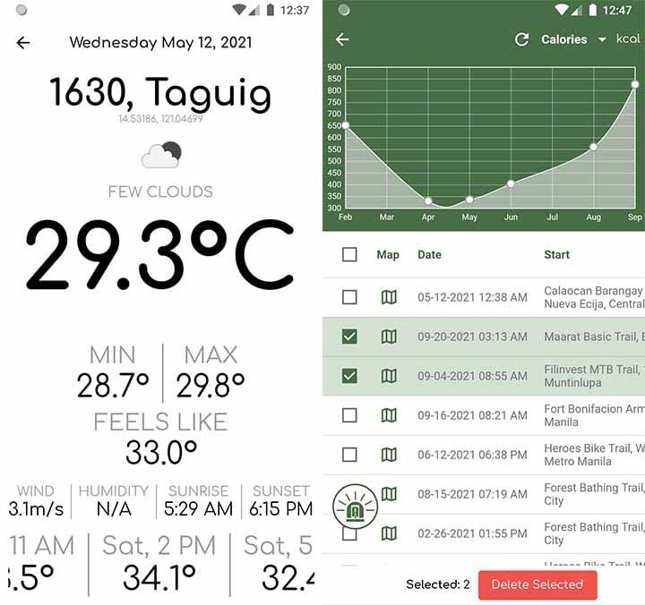
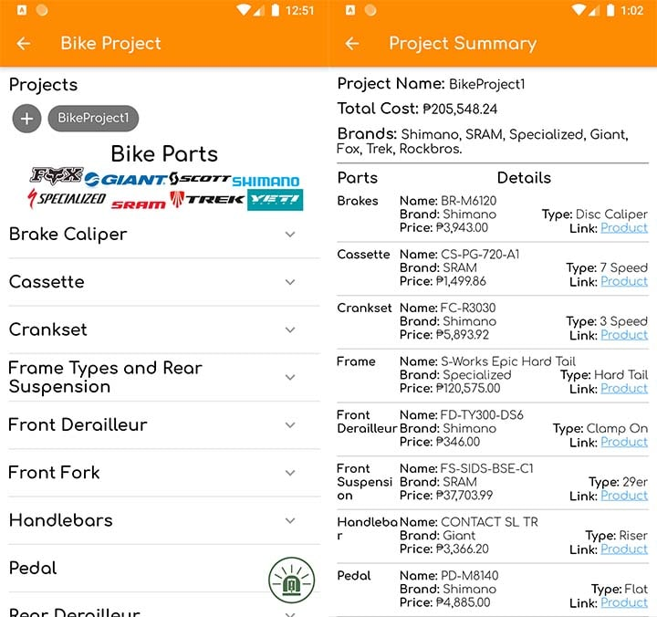
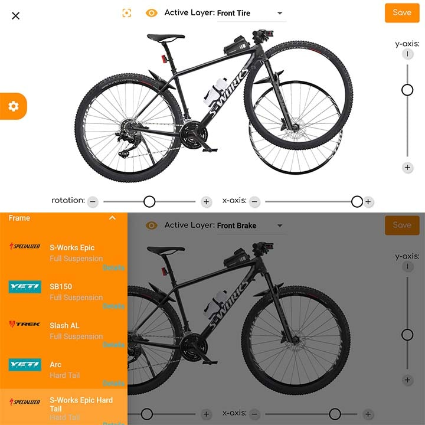
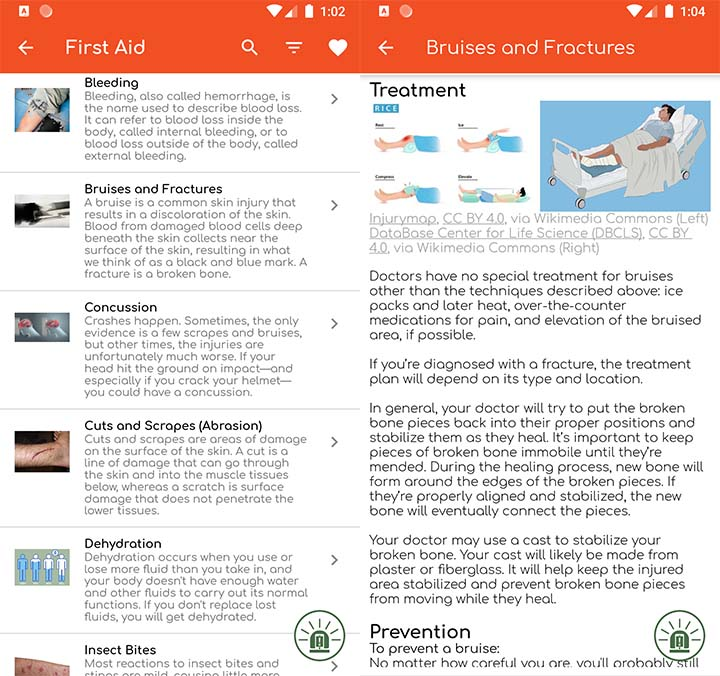
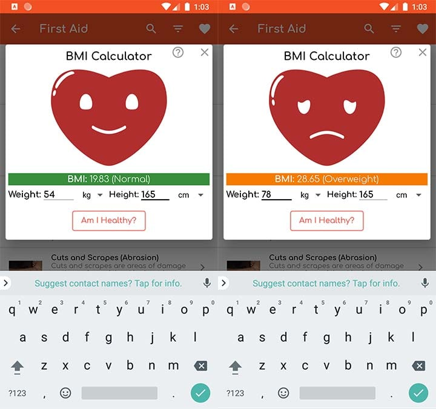
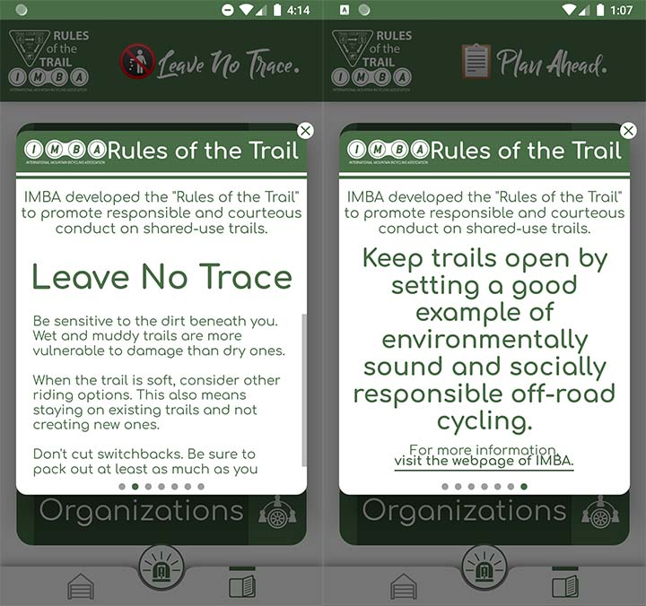
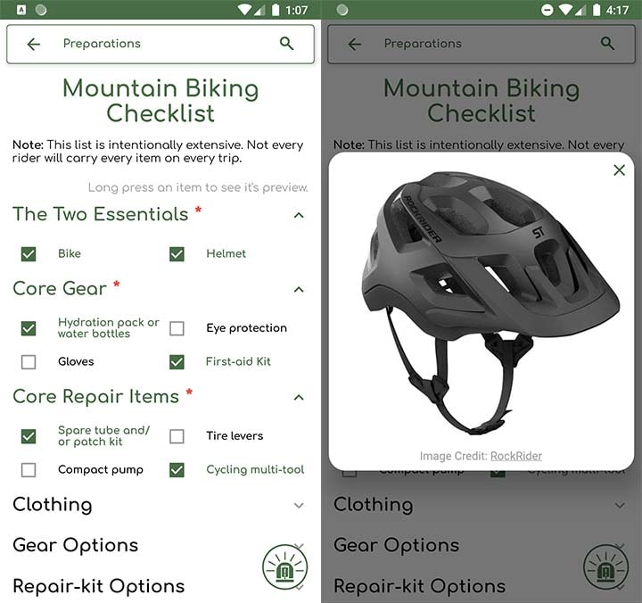
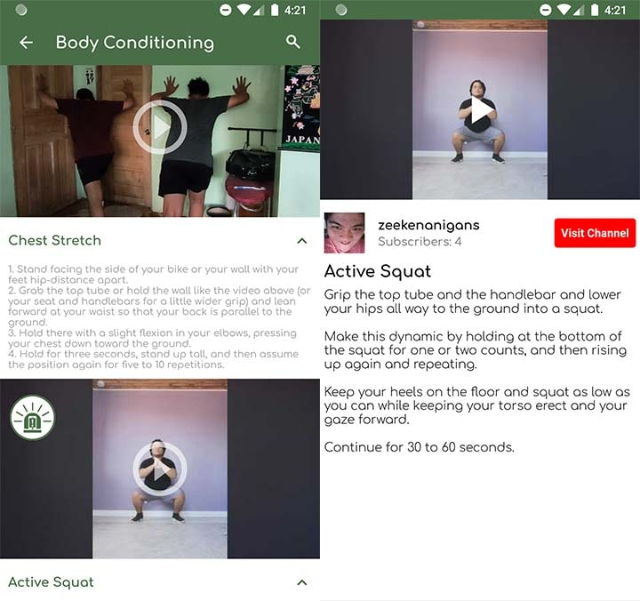

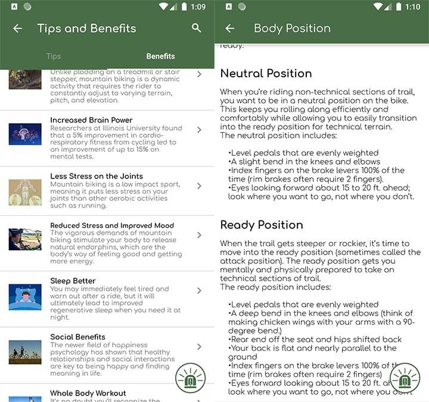
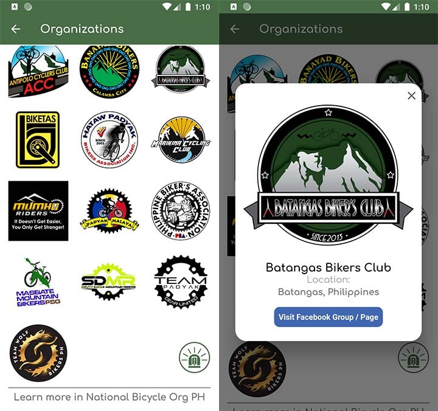

## Project Specifications
**Methodoly:** Agile with Scrum\
**Languge:** Dart\
**Framework:** Flutter\
**Completion Time:** 6 1/2 Months

### Features/Modules
- Allows Max(5) Profiles
- Top 10 Philippine Trails
- Navigation Tracking
- Activity Tracker
- 2D Bike Projector Creator
- First Aid Details (Description, Treatment, Prevention)
- Incorporated International Mountain Biking Association's rules and objectives
- Video Tutorials(Repair and Maintenance, and Body Conditioning)
- Extensive Cheklist with Item Preview
- Tips and Benefits for MTB Activity
- List of MTB Organizations in the Philippines including their SocMed group page.
